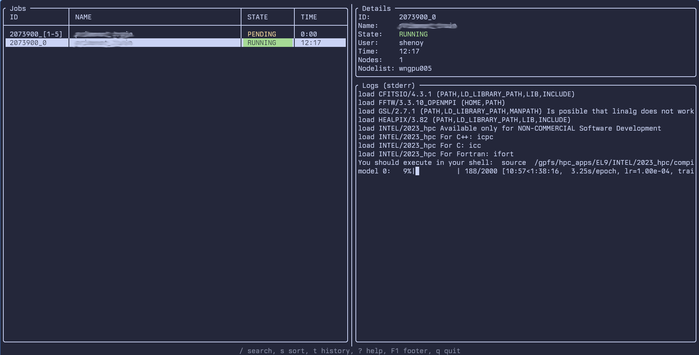

# SLURMON

SLURM monitoring utility

# Features

- Interactive List of jobs
- Cancel jobs
- View job details
- View job logs (stdout and stderr)

# Screenshot



# Installation

## Requirements

- CMake 3.12 or newer
- A C++17 compiler (GCC 9+ / Clang 10+)
- A working SLURM installation (`squeue`, `sacct`, `scancel`, `scontrol` on `PATH`)

## Build and install

```sh
git clone https://github.com/dheerajshenoy/slurmon.git
cd slurmon
cmake -S . -B build -DCMAKE_BUILD_TYPE=Release
cmake --build build -j
sudo cmake --install build
```

By default this installs:

- the `slurmon` binary to `/usr/local/bin`
- the man page to `/usr/local/share/man/man1/slurmon.1`
- `example_config.toml` to `/usr/local/share/doc/slurmon`

Set `-DCMAKE_INSTALL_PREFIX=$HOME/.local` (and drop the `sudo`) to install
into your home directory instead.

## Configuration

Copy the reference config into place and edit to taste:

```sh
mkdir -p ~/.config/slurmon
cp example_config.toml ~/.config/slurmon/config.toml
```

Run `man slurmon` for the full option and key-binding reference.

# TODO

- [x] Configuration
- [x] Search jobs
- [x] Cancel job with confirmation
- [x] Historical job info using `sacct`
- [x] Array job expand/collapse view
- [ ] More colors
- [ ] Quick resubmit / clone job
- [x] Sort jobs
